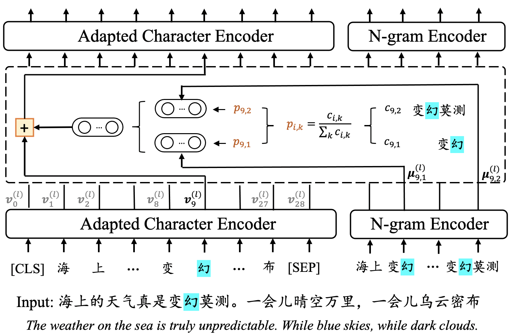

# ZEN 2.0

ZEN 2.0 is a pre-trained language model with Chinese and Arabic versions. 
ZEN 2.0 is based on the architecture of [ZEN 1.0](https://github.com/sinovation/ZEN) with an update and adaptation from the following three aspects:

- **Refined N-gram Representations**  
We  refine  the  representations  of n-grams by applying weights to the n-gram representations when they are integrated into the character encoder.
- **Whole N-gram Masking**  
In the training stage, we mask n-grams/words, rather than characters, in the input text of the character encoders.
- **Relative Positional Encoding**  
We utilize relative positional encoding for the character encoder to model direction and distance information from the input text.

The structure of ZEN 2.0 is illustrated in the following figure. We elaborate the differences between ZEN 2.0 and ZEN 1.0 at [here](./docs/README.md).
　



## Citation

If you use or extend our work, please cite the following [**paper**](https://arxiv.org/abs/2105.01279):
```
@article{Sinovation2021ZEN2,
  title="{ZEN 2.0: Continue Training and Adaption for N-gram Enhanced Text Encoders}",
  author={Yan Song, Tong Zhang, Yonggang Wang, Kai-Fu Lee},
  journal={arXiv preprint arXiv:1911.00720},
  year={2021},
}
```

## Quick tour of pre-training and fine-tune using ZEN 2.0

The library comprises several example scripts for conducting [**Chinese/Arabic NLP tasks**](/datasets):

- `run_pre_train.py`: an example pre-training ZEN 2.0
- `run_sequence_level_classification.py`: an example fine-tuning ZEN 2.0 on DC, SA, SPM, NLI and QA tasks (*sequence-level classification*)
- `run_token_level_classification.py`: an example fine-tuning ZEN 2.0 on CWS, POS and NER tasks (*token-level classification*)
- `run_mrc_task.py`: an example fine-tuning ZEN 2.0 on MRC tasks

[**Examples**](/examples) of pre-training and fine-tune using ZEN 2.0.


## Contact information

For help or issues using ZEN 2.0, please submit a GitHub issue.

For personal communication related to ZEN 2.0, please contact Guimin Chen (`chenguimin@chuangxin.com`) or Yuanhe Tian (`yhtian@uw.edu`).

