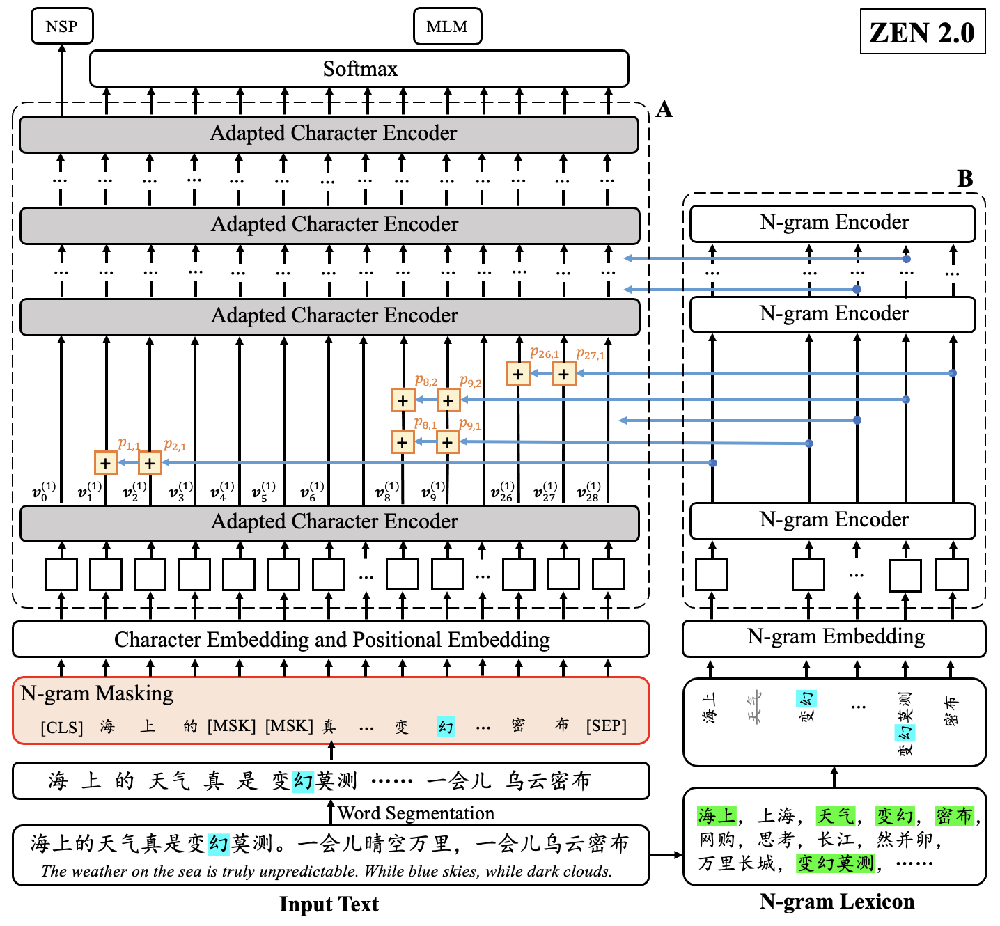

## Differences between ZEN 2.0 and ZEN 1.0

The overall architecture of ZEN 2.0 is illustrated in the following figure, where the three updates are highlighted in different colors.

- **Refined N-gram Representations** (Highlighted in Yellow)  
In ZEN 1.0, n-gram representations are directly added to the associated character representation,
whereas in ZEN 2.0, we apply a weight *pi,k* to the *i*-th character and the *k*-th n-gram when using the n-gram representation to enhance the character representation.

- **Whole N-gram Masking** (Highlighted in Red)  
ZEN 1.0 uses word-piece (character) masking where randomly selected characters are replaced by a special token `[MASK]`.
In ZEN 2.0, we firstly use a tokenizer to segment the input into n-grams and then mask the input based on the resulting n-grams rather than the word-pieces (characters).

- **Relative Positional Encoding** (Highlighted in Gray)  
ZEN 1.0 uses the vanilla Transformer for character encoder. However, ZEN 2.0 uses Adapted Transformer with relative positional encoding, where the relative position information of the input is modeled during the encoding process.
